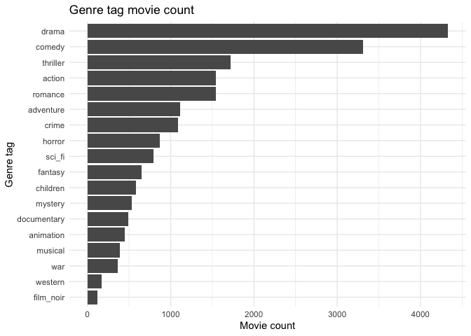
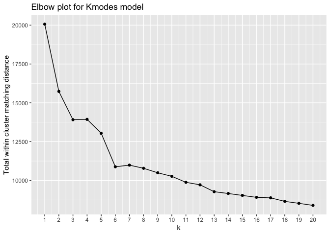
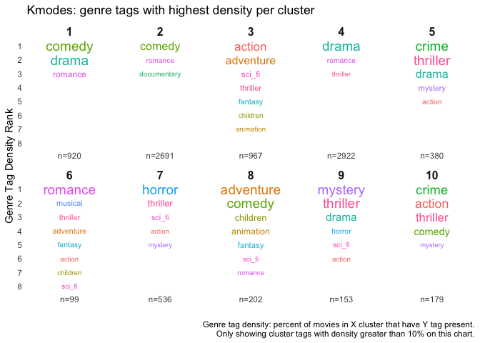

Movie genre clustering
================

### Notebook objective

  - cluster movies into genre groups
  - explore clustering methods for categorical data/features only  
  - potential business use case might be to organize site navigation by
    movie clusters, market genre clusters to a target audience,
    investigate user behaviors and retention based on consumption of X
    genre cluster

### Packages

``` r
required_packages <- c('tidyverse', 'dslabs', 'klaR', 'knitr', 'kableExtra')
for(p in required_packages) {
  ### un-comment the below lines to install packages not installed
  # if(!require(p,character.only = TRUE))
  #       install.packages(p, repos = "http://cran.us.r-project.org")
  library(p,character.only = TRUE)
}
pct_formater_1 <- scales::label_percent(accuracy = 1)
```

### Movielens data from dslabs package

  - \~100k user movie ratings
  - [dslabs package
    code](https://github.com/rafalab/dslabs/blob/master/inst/script/make-movielens.R)
    that generates the data and includes source data link
  - see the raw data source for detailed description of the data
  - this notebook uses the movies meta data and movie genre tags for
    clustering analysis

<!-- end list -->

``` r
movielens %>%
      sample_n(5) %>%
      glimpse()
```

    ## Rows: 5
    ## Columns: 7
    ## $ movieId   <int> 42418, 8604, 95, 1246, 1323
    ## $ title     <chr> "New World, The", "Taxi", "Broken Arrow", "Dead Poets Socie…
    ## $ year      <int> 2005, 1998, 1996, 1989, 1983
    ## $ genres    <fct> Adventure|Drama|Romance, Action|Comedy, Action|Adventure|Th…
    ## $ userId    <int> 475, 200, 624, 215, 514
    ## $ rating    <dbl> 2.0, 2.5, 2.0, 4.0, 2.0
    ## $ timestamp <int> 1447328927, 1438019943, 1019124644, 860561236, 853894850

### Build movies dataset for genre clustering

  - one movie per row with genre tags as separate columns

<!-- end list -->

``` r
movies_df <- movielens %>% 
  filter(genres!="(no genres listed)") %>%
  dplyr::select(movieId, genres) %>%
  distinct() %>%
  mutate(action = str_detect(genres, 'Action'),
         adventure = str_detect(genres, 'Adventure'),
         animation = str_detect(genres, 'Animation'),
         children = str_detect(genres, 'Children'),
         comedy = str_detect(genres, 'Comedy'),
         crime = str_detect(genres, 'Crime'),
         documentary = str_detect(genres, 'Documentary'),
         drama = str_detect(genres, 'Drama'),
         fantasy = str_detect(genres, 'Fantasy'),
         film_noir = str_detect(genres, 'Film-Noir'),
         horror = str_detect(genres, 'Horror'),
         musical = str_detect(genres, 'Musical'),
         mystery = str_detect(genres, 'Mystery'),
         romance = str_detect(genres, 'Romance'),
         sci_fi = str_detect(genres, 'Sci-Fi'),
         thriller = str_detect(genres, 'Thriller'),
         war = str_detect(genres, 'War'),
         western = str_detect(genres, 'Western')) %>%
  mutate_if(is.logical, as.numeric)

movies_df %>%
      sample_n(5) %>%
      glimpse()
```

    ## Rows: 5
    ## Columns: 20
    ## $ movieId     <int> 7771, 3800, 1076, 113573, 3223
    ## $ genres      <fct> Adventure|Drama, Crime|Drama|Romance|Thriller, Drama|Horr…
    ## $ action      <dbl> 0, 0, 0, 1, 0
    ## $ adventure   <dbl> 1, 0, 0, 0, 0
    ## $ animation   <dbl> 0, 0, 0, 0, 0
    ## $ children    <dbl> 0, 0, 0, 0, 0
    ## $ comedy      <dbl> 0, 0, 0, 0, 0
    ## $ crime       <dbl> 0, 1, 0, 1, 0
    ## $ documentary <dbl> 0, 0, 0, 0, 0
    ## $ drama       <dbl> 1, 1, 1, 0, 1
    ## $ fantasy     <dbl> 0, 0, 0, 0, 0
    ## $ film_noir   <dbl> 0, 0, 0, 0, 0
    ## $ horror      <dbl> 0, 0, 1, 0, 0
    ## $ musical     <dbl> 0, 0, 0, 0, 0
    ## $ mystery     <dbl> 0, 0, 0, 0, 0
    ## $ romance     <dbl> 0, 1, 0, 0, 0
    ## $ sci_fi      <dbl> 0, 0, 0, 0, 0
    ## $ thriller    <dbl> 0, 1, 1, 1, 0
    ## $ war         <dbl> 0, 0, 0, 0, 0
    ## $ western     <dbl> 0, 0, 0, 0, 0

### Exploratory Visualizations

  - main purpose of this notebook is for clustering
  - brief visual inspection of the data for intuition building

##### Movie count by genre label

  - drama genre tag is popular in this dataset
  - note: movies can be assign multiple genre tags

<!-- end list -->

``` r
movies_df %>%
  gather(key="genre", value="flag", -movieId, -genres) %>%
  group_by(genre) %>%
  summarise(movie_count_genre_tag = sum(flag)) %>%
  ggplot(aes(y=reorder(genre, movie_count_genre_tag), 
             x=movie_count_genre_tag)) +
  geom_col() +
  theme_minimal() +
  labs(title="Genre tag movie count",
       y="Genre tag",
       x="Movie count")
```

<!-- -->

##### Movie genre tag count distribution

  - most movies have 1, 2, or 3 genre tags

<!-- end list -->

``` r
movies_df %>%
  mutate(genre_tag_count = str_count(genres, "\\|")+1) %>%
  group_by(genre_tag_count) %>%
  summarise(movie_count = n()) %>%
  mutate(percent_total = movie_count/sum(movie_count)) %>%
  ggplot(aes(x=factor(genre_tag_count),
             y=percent_total)) +
  geom_col(fill="dodgerblue") +
  geom_text(aes(label=movie_count, vjust=-0.5),
            expand = expansion(mult = c(0.05, .1))) +
    theme_minimal() +
  labs(title="Volume of movies by tag count",
       y="Percent of Total Movies",
       x="Movie genre tag count") +
  scale_y_continuous(label = scales::percent_format(accuracy=1))
```

<!-- -->

### Most common single genre tag

``` r
movies_df %>%
  mutate(genre_tag_count = str_count(genres, "\\|")+1) %>%
  filter(genre_tag_count==1) %>%
  count(genres, sort=T) %>%
  head(5) %>%
  kbl(caption = "Most common single genre movies") %>%
  kable_classic(full_width = F, html_font = "Cambria")
```

<table class=" lightable-classic" style="font-family: Cambria; width: auto !important; margin-left: auto; margin-right: auto;">

<caption>

Most common single genre movies

</caption>

<thead>

<tr>

<th style="text-align:left;">

genres

</th>

<th style="text-align:right;">

n

</th>

</tr>

</thead>

<tbody>

<tr>

<td style="text-align:left;">

Drama

</td>

<td style="text-align:right;">

1156

</td>

</tr>

<tr>

<td style="text-align:left;">

Comedy

</td>

<td style="text-align:right;">

804

</td>

</tr>

<tr>

<td style="text-align:left;">

Documentary

</td>

<td style="text-align:right;">

359

</td>

</tr>

<tr>

<td style="text-align:left;">

Horror

</td>

<td style="text-align:right;">

182

</td>

</tr>

<tr>

<td style="text-align:left;">

Thriller

</td>

<td style="text-align:right;">

74

</td>

</tr>

</tbody>

</table>

## Kmodes overview

  - kmodes model aims to identify k clusters with the goal of minimizing
    the dissimilarity between clusters
  - dissimilarity measured by simple matching
  - if two observations have the same feature values then dissimilarity
    is zero
  - dissimilarity increases as the number of different feature values
    between two observations increases

### Kmodes model to cluster movies based on genre tags

  - visually inspect what an optimal k value might be

<!-- end list -->

``` r
### only the genre tag features
movies_df_genres_only <- movies_df %>% 
  dplyr::select(-movieId, -genres)

### for a given k value get the total within cluster matching distance 
kmode_twcd <- function(k_var) {
  set.seed(123)
  result <- sum(kmodes(movies_df_genres_only, modes=k_var, 
             iter.max=20, weighted=F)$withindiff)
  return(result)
}

### elbow plot df
k.max <- 20
elbow_df <- tibble(k = 1:k.max,
       total_within_cluster_distance = map_dbl(1:k.max, ~kmode_twcd(.))) 

### elbow plot
elbow_df %>%
  ggplot(aes(x=k,
           y=total_within_cluster_distance)) +
  geom_point() +
  geom_line(aes(group="var")) +
  scale_x_continuous(breaks=1:k.max) +
  labs(y="Total within cluster matching distance",
       title="Elbow plot for Kmodes model")
```

<!-- -->

### Explore Kmode clusters

  - move forward with k mode value of 10 as it is near the elbow (using
    elbow method to visually determine optimal k)
  - investigate cluster mode values where genre tag is present
  - by cluster, highlight the most common genre tag(s)

<!-- end list -->

``` r
### kmode with directionally optimal k value
set.seed(123)
kmodes_movies <- kmodes(movies_df_genres_only, 
                        modes=10, iter.max = 50, weighted = FALSE, fast = TRUE)

### generate cluster mode summary df
cluster_table_summary <- tibble(cluster = 1:length(kmodes_movies$size),
                    cluster_size = kmodes_movies$size) %>%
  bind_cols(kmodes_movies$modes) %>%
  gather(key="genre", value="mode_flag", -cluster, -cluster_size) %>%
  filter(mode_flag==1) %>%
  group_by(cluster, cluster_size) %>%
  ### reverse alphabetical order
  arrange(desc(genre)) %>%
  summarise(genre_modes_by_cluster = paste0(genre, collapse = ", "))

cluster_table_summary %>%
  kbl(caption = "Genre tag modes by cluster") %>%
  kable_classic(full_width = F, html_font = "Cambria")
```

<table class=" lightable-classic" style="font-family: Cambria; width: auto !important; margin-left: auto; margin-right: auto;">

<caption>

Genre tag modes by cluster

</caption>

<thead>

<tr>

<th style="text-align:right;">

cluster

</th>

<th style="text-align:right;">

cluster\_size

</th>

<th style="text-align:left;">

genre\_modes\_by\_cluster

</th>

</tr>

</thead>

<tbody>

<tr>

<td style="text-align:right;">

1

</td>

<td style="text-align:right;">

920

</td>

<td style="text-align:left;">

drama, comedy

</td>

</tr>

<tr>

<td style="text-align:right;">

2

</td>

<td style="text-align:right;">

2691

</td>

<td style="text-align:left;">

comedy

</td>

</tr>

<tr>

<td style="text-align:right;">

3

</td>

<td style="text-align:right;">

967

</td>

<td style="text-align:left;">

adventure, action

</td>

</tr>

<tr>

<td style="text-align:right;">

4

</td>

<td style="text-align:right;">

2922

</td>

<td style="text-align:left;">

drama

</td>

</tr>

<tr>

<td style="text-align:right;">

5

</td>

<td style="text-align:right;">

380

</td>

<td style="text-align:left;">

thriller, drama, crime

</td>

</tr>

<tr>

<td style="text-align:right;">

6

</td>

<td style="text-align:right;">

99

</td>

<td style="text-align:left;">

romance

</td>

</tr>

<tr>

<td style="text-align:right;">

7

</td>

<td style="text-align:right;">

536

</td>

<td style="text-align:left;">

horror

</td>

</tr>

<tr>

<td style="text-align:right;">

8

</td>

<td style="text-align:right;">

202

</td>

<td style="text-align:left;">

comedy, adventure

</td>

</tr>

<tr>

<td style="text-align:right;">

9

</td>

<td style="text-align:right;">

153

</td>

<td style="text-align:left;">

thriller, mystery, drama

</td>

</tr>

<tr>

<td style="text-align:right;">

10

</td>

<td style="text-align:right;">

179

</td>

<td style="text-align:left;">

thriller, crime, comedy, action

</td>

</tr>

</tbody>

</table>

### Kmode: generate summary stats and visualize the clusters

``` r
movies_df_2 <- movies_df %>%
  mutate(cluster = kmodes_movies$cluster)

kmodes_df <- movies_df %>%
  mutate(kmodes_clusters = kmodes_movies$cluster) %>%
  group_by(kmodes_clusters) %>%
  mutate(cluster_movies_count = n_distinct(movieId)) %>%
  group_by(kmodes_clusters, cluster_movies_count) %>%
  summarise_at(vars(action:western), sum) %>%
  mutate_at(vars(action:western), ~(./cluster_movies_count)) %>%
  gather(key="genre", value="movie_tag_density", 
         -kmodes_clusters, -cluster_movies_count)

kmodes_df %>%
  group_by(kmodes_clusters) %>%
  mutate(tag_density_rank = row_number(-movie_tag_density)) %>%
  ungroup() %>%
  filter(movie_tag_density>=0.1) %>%
  ggplot(aes(y=tag_density_rank,
             x=paste0("n=",cluster_movies_count),
             size=movie_tag_density,
             color=genre)) +
  geom_text(aes(label=genre)) +
  facet_wrap(. ~ kmodes_clusters, ncol=5, scale="free_x") +
  scale_y_reverse(breaks=1:100) +
  scale_radius(range = c(2.5,5)) +
  labs(title="Kmodes: genre tags with highest density per cluster",
    y="Genre Tag Density Rank",
    x="",
    caption = "Genre tag density: percent of movies in X cluster that have Y tag present.
Only showing cluster tags with density greater than 10% on this chart.") +
  theme_minimal() +
  theme(legend.position = "none",
        strip.text.x = element_text(size=12, face="bold"),
        panel.grid.minor = element_blank(),
        panel.grid.major = element_blank())
```

<!-- -->

## Hierarchical Clustering

  - perform agglomerative hierarchical clustering
  - bottom up approach where each observation starts out as a single
    cluster then clusters are formed based on similarity
  - a bottoms up tree is generated and we can cut the tree to find a
    desired number of clusters
  - distance matrix with Jaccard Distance is used which handles
    categorical features
  - Hclust used from the stats package with ward.D2 method
  - ward method aims to minimizes the total within-cluster variance at
    each algo step

### Hclust using Jaccard Distance

  - for visual comparison to Kmodes view hclust results with 10 clusters

<!-- end list -->

``` r
### Jaccard Distance (1 - Jaccard Index)
### Jaccard Index: intersection / union between variables
jaccard_dist <- dist(movies_df_genres_only, method = "binary")

set.seed(123)
dendrogram <- hclust(jaccard_dist, method="ward.D2")

### cut the tree into k clusters
k_clusters <- cutree(dendrogram, k=10)

hcluster_df <- movies_df %>%
  mutate(hclust_clusters = k_clusters) %>%
  group_by(hclust_clusters) %>%
  mutate(cluster_movies_count = n_distinct(movieId)) %>%
  group_by(hclust_clusters, cluster_movies_count) %>%
  summarise_at(vars(action:western), sum) %>%
  mutate_at(vars(action:western), ~(./cluster_movies_count)) %>%
  gather(key="genre", value="movie_tag_density", 
         -hclust_clusters, -cluster_movies_count)

hcluster_df %>%
  group_by(hclust_clusters) %>%
  mutate(tag_density_rank = row_number(-movie_tag_density)) %>%
  ungroup() %>%
  filter(movie_tag_density>=0.1) %>%
  ggplot(aes(y=tag_density_rank,
             x=paste0("n=",cluster_movies_count),
             size=movie_tag_density,
             color=genre)) +
  geom_text(aes(label=genre)) +
  facet_wrap(. ~ hclust_clusters, ncol=5, scale="free_x") +
  scale_y_reverse(breaks=1:100) +
  scale_radius(range = c(2.5,5)) +
  labs(title="Hclust: genre tags with highest density per cluster",
    y="Genre Tag Density Rank",
    x="",
    caption = "Genre tag density: percent of movies in X cluster that have Y tag present.
Only showing cluster tags with density greater than 10% on this chart.") +
  theme_minimal() +
  theme(legend.position = "none",
        strip.text.x = element_text(size=12, face="bold"),
        panel.grid.minor = element_blank(),
        panel.grid.major = element_blank())
```

<!-- -->

### Key Takeaways

  - In this notebook, hierarchical clustering produces more balanced
    clusters and looks to be a more useful output.
  - Kmodes output resulted in two main clusters (\#2 comedy and \#4
    drama).
  - Most of the hclust clusters seem intuitive.
  - Hclust \#2 looks like a catchall for movies not grouped in the other
    clusters with more dominant themes.
  - Use visualizations to help describe the clusters to stakeholders.
  - Similar to clustering numeric data or mixed data, clustering
    categorical data is subjective with multiple approaches one might
    take. Business needs would likely influence the number of clusters
    and desired cluster size.
  - Compared to numeric data clustering, resources for clustering
    categorical data are not as common.

### Future investigations

  - [ROCK clustering algo for categorical / binary
    data](https://cran.r-project.org/web/packages/cba/cba.pdf)
  - Additional metrics / methods for finding the optimal k value for
    Kmode and hclust
